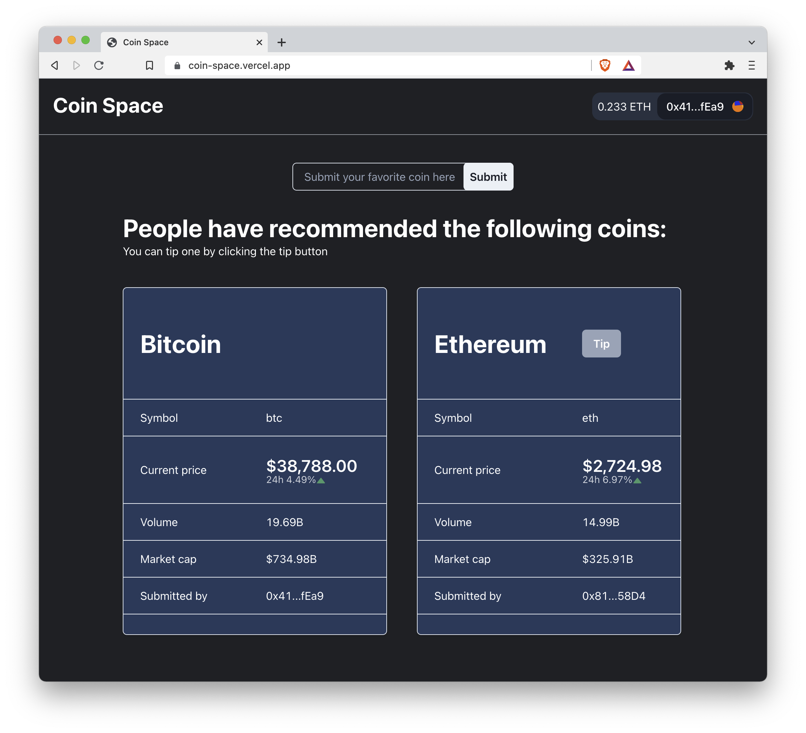
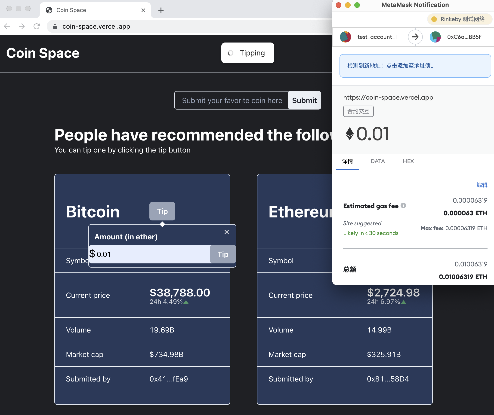

# CoinSpace

[`CoinSpace`](https://coin-space.vercel.app/) is a DApp where you can

- recommend your favorite coins to others
- tip others for having recommended a good coin.

[Smart contract](./contract) of `CoinSpace` was developed using `HardHat`, and deployed to Rinkeby testnet.

[Front end](./front_end) of `CoinSpace` was developed using `Typescript`, `Next.js`, `Chakra-ui`, and `useDApp`; and deployed with `Vercel`.

## How to use

### Prerequisites

- `MetaMask` installed
- Network switched to Rinkeby Testnet (If you don't have test eth in rinkeby, you can get some [here](https://faucets.chain.link/rinkeby))

### Login

When you first enter `CoinSpace`, you need to connect your wallet to the website by clicking the `Connect to a wallet` button.

After clicking, a metamask memu will pop out asking for your permission to connect.

If your account address showes on the top right corner, you have successfully connected `CoinSpace` with your wallet.

Also you can see your eth balance on the left of your accout. You can see more info by clicking the address.

### Submit a coin

`CoinSpace` displays all the coins people have recommended. If your favorite coin is not included, you can submit it by entering either the coin id (e.g. bitcoin) or the coin symbol (e.g. btc) in the input area and hitting submit button.

For now, user can only submit coins that listed on [CoinGecko](https://www.coingecko.com)

You'll get a notification when other people have submitted a new coin.

By the way, `CoinSpace` fetches the current price of coins from CoinGecko.

### Tip others

If you like a coin someone submitted, you can tip she/he by clicking the `Tip` button near the coin name and entering a tip amount.

You'll get a notification when receiving a tip from others.

